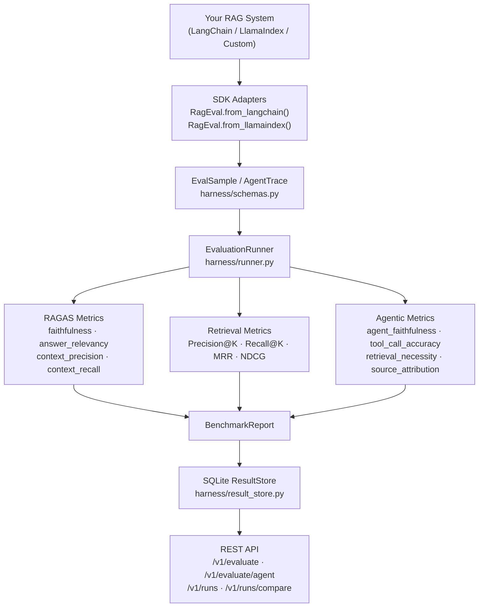

# RAG Benchmarking


[](https://pypi.org/project/rag-benchmarking/)

**A framework-agnostic evaluation harness for RAG and agentic AI systems.**

Bring your own RAG pipeline — LangChain, LlamaIndex, or custom — and benchmark it against standard classic and agentic-era metrics. Built for teams who need to prove their AI systems work before they ship, not hope they do.

> Part of the [AiExponent](https://aiexponent.com) open source portfolio. Maps to EU AI Act Article 15 (accuracy requirements).

---

## Quick Start

### Install

```bash
# Install from PyPI (recommended)
pip install rag-benchmarking

# Or install from source
git clone https://github.com/aiexponenthq/rag-benchmarking.git
cd rag-benchmarking
pip install -e ".[test]"
```

### Evaluate your existing RAG system in 5 minutes

```python
from app.sdk.client import RagEval

client = RagEval(api_url="http://localhost:5001", api_key="your-key")

# LangChain integration
from langchain.chains import RetrievalQA
chain = RetrievalQA.from_chain_type(...)
result = chain.invoke({"query": "What is RAG?"})
sample = RagEval.from_langchain(result)

# LlamaIndex integration
engine = index.as_query_engine()
response = engine.query("What is RAG?")
sample = RagEval.from_llamaindex(response, "What is RAG?")

# Or any dict with question / contexts / answer
sample = {
    "question": "What is RAG?",
    "contexts": ["RAG stands for Retrieval-Augmented Generation."],
    "answer": "RAG combines retrieval with LLM generation.",
}

report = client.evaluate([sample], metrics=["faithfulness", "answer_relevancy"])
print(report["scores"])
# {"faithfulness": 0.92, "answer_relevancy": 0.88}
```

### Start the evaluation server

```bash
# With Docker Compose
docker compose up

# Or directly
uvicorn app.main:app --port 5001
```

### Interactive API docs

Once the server is running, the full OpenAPI reference is available at:

```
http://localhost:5001/docs
```

---

## LLM Backend for Evaluation

Several metrics (faithfulness, context_precision, context_recall, agent_faithfulness, tool_call_accuracy, retrieval_necessity) use an LLM as a judge. The harness supports **Gemini** (recommended) and **OpenAI**.

```bash
# Set in .env:
LLM_PROVIDER=gemini
GEMINI_API_KEY=your-gemini-key

# Or OpenAI:
LLM_PROVIDER=openai
OPENAI_API_KEY=your-openai-key
```

**Determinism:** Judge calls run at `temperature=0.0` to minimise variance across evaluation runs. For CI/CD integration, run evaluations at least twice and flag changes beyond a ±0.05 threshold rather than asserting exact scores.

**Cost guidance:** A full evaluation pass (all classic metrics) on 50 samples costs approximately $0.05–$0.15 with Gemini Flash or GPT-4o-mini. Source attribution accuracy is deterministic and costs nothing.

---

## Metrics

### Classic RAG Metrics

| Metric | What it measures | Requires |
|---|---|---|
| `faithfulness` | Are all claims in the answer supported by context? | question, contexts, answer |
| `answer_relevancy` | Does the answer address the question? | question, answer |
| `context_precision` | Are retrieved chunks relevant to the query? | + ground_truth |
| `context_recall` | Does context contain enough to answer correctly? | + ground_truth |
| `precision_at_k` | Fraction of top-K retrieved docs that are relevant | + retrieved_doc_ids, relevant_doc_ids |
| `recall_at_k` | Fraction of relevant docs found in top-K | + retrieved_doc_ids, relevant_doc_ids |
| `mrr` | Reciprocal rank of first relevant doc | + retrieved_doc_ids, relevant_doc_ids |
| `ndcg_at_k` | Rank-weighted retrieval quality | + retrieved_doc_ids, relevant_doc_ids |

### Agentic-Era Metrics

For multi-step agents, tool-using systems, and autonomous RAG pipelines:

| Metric | What it measures | LLM needed? |
|---|---|---|
| `source_attribution_accuracy` | Did the agent cite sources it actually retrieved? | No (deterministic) |
| `agent_faithfulness` | Is every reasoning step faithful to retrieved sources? | Yes |
| `tool_call_accuracy` | Did the agent choose the right tool at the right time? | Yes |
| `retrieval_necessity` | Was retrieval actually needed for this query? | Yes |

### Metric Groups

| Group | Metrics included |
|---|---|
| `classic` | faithfulness, answer_relevancy |
| `retrieval` | precision_at_k, recall_at_k, mrr, ndcg_at_k |
| `agentic_v1` | source_attribution_accuracy, retrieval_necessity, agent_faithfulness, tool_call_accuracy |
| `agentic_v2` | multihop_faithfulness, agent_trajectory_efficiency, reasoning_hallucination, context_coherence_across_turns |
| `full` | all classic + retrieval + agentic_v1 metrics |

```python
# Use a pre-defined group instead of listing metrics individually
report = client.evaluate(samples, metric_group="classic")
```

---

## API Reference

### REST API

```bash
# Classic RAG evaluation
curl -X POST http://localhost:5001/v1/evaluate \
  -H "X-API-Key: your-key" \
  -H "Content-Type: application/json" \
  -d '{
    "samples": [{
      "question": "What is RAG?",
      "contexts": ["RAG is Retrieval-Augmented Generation."],
      "answer": "RAG combines retrieval with LLM generation."
    }],
    "metrics": ["faithfulness", "answer_relevancy"]
  }'

# Agentic trace evaluation
curl -X POST http://localhost:5001/v1/evaluate/agent \
  -H "X-API-Key: your-key" \
  -H "Content-Type: application/json" \
  -d '{
    "trace": {
      "question": "What is the GPAI deadline?",
      "final_answer": "GPAI obligations apply from August 2025.",
      "tool_calls": [{
        "tool_name": "retrieve",
        "tool_input": {"query": "GPAI deadline"},
        "tool_output": "Article 53 obligations apply from August 2025.",
        "step_index": 0
      }]
    },
    "metrics": ["source_attribution_accuracy", "tool_call_accuracy"]
  }'

# List and compare runs
curl http://localhost:5001/v1/runs -H "X-API-Key: your-key"
curl -X POST http://localhost:5001/v1/runs/compare \
  -H "X-API-Key: your-key" \
  -d '["run-id-a", "run-id-b"]'
```

### Python SDK

```python
from app.sdk.client import RagEval

client = RagEval(api_url="http://localhost:5001", api_key="your-key")

# Classic evaluation
report = client.evaluate(samples, metrics=["faithfulness"])
report = client.evaluate(samples, metric_group="agentic_v1")

# Agentic trace
report = client.evaluate_agent(trace_dict, metrics=["agent_faithfulness"])

# Run history and comparison
runs = client.list_runs()
comparison = client.compare_runs(["run-a", "run-b"])
```

---

## Architecture



### Plug-in contract

Any RAG system implements one method to integrate:

```python
class MyRAG:
    def run(self, question: str, contexts_override=None) -> dict:
        result = self.chain.invoke({"query": question})
        return {
            "answer": result["result"],
            "contexts": [d.page_content for d in result["source_documents"]],
            "retrieved_doc_ids": [d.metadata.get("id") for d in result["source_documents"]],
        }
```

---

## Configuration

Copy `.env.example` to `.env` and set:

```bash
# LLM provider for faithfulness judge
LLM_PROVIDER=gemini          # or openai
GEMINI_API_KEY=...
OPENAI_API_KEY=...

# Vector store (built-in RAG pipeline only)
QDRANT_URL=https://your-cluster.qdrant.io
QDRANT_API_KEY=...

# API authentication
API_KEY=your-secret-key
ENFORCE_API_KEY=true
```

---

## Project Structure

```
src/
  harness/                   # Framework-agnostic evaluation harness
    schemas.py               # EvalSample, AgentTrace, BenchmarkReport, RunConfig
    protocol.py              # RAGEvaluable Protocol — the plug-in contract
    runner.py                # EvaluationRunner — orchestrates metrics
    result_store.py          # SQLite persistence for BenchmarkReport
  app/
    api/                     # FastAPI endpoints
    eval/
      ragas_runner.py        # RAGAS classic metrics
      retrieval_metrics.py   # Precision@K, Recall@K, MRR, NDCG
      faithfulness.py        # Claim-decomposition faithfulness (LLM-as-judge)
      agentic_metrics.py     # source_attribution_accuracy (deterministic)
      agentic_llm_metrics.py # LLM-as-judge agentic metrics
    sdk/                     # Python SDK (RagEval client)
    engine/                  # Built-in RAG pipeline (optional)

data/
  golden/qa.jsonl            # 50-sample golden dataset (10 domains)

tests/
  unit/                      # Unit tests (no LLM, no network)
  integration/               # SDK integration tests
  e2e/                       # Full API endpoint tests
```

---

## EU AI Act Context

Maps to **Article 15** — Accuracy, Robustness and Cybersecurity for High-Risk AI Systems. Systematic RAG evaluation implements the technical testing requirements for demonstrating accuracy under Article 15.

---

## Known Limitations

- Benchmark datasets are English-only; no multilingual evaluation support.
- Custom dataset integration requires manual formatting to the JSONL schema.
- Accuracy metrics only — latency and throughput are not measured.
- LLM-as-judge metrics depend on the quality of the configured judge model.
- Rate limiting is in-memory and resets on server restart.

---

## Version Compatibility

| Dependency | Tested version |
|---|---|
| Python | 3.11, 3.12 |
| RAGAS | 0.4.x |
| LangChain | ≥ 0.1 |
| LlamaIndex | ≥ 0.10 |
| FastAPI | ≥ 0.110 |

---

## Further Reading

- [DEPLOYMENT.md](DEPLOYMENT.md) — Docker, Kubernetes, security configuration
- [CONTRIBUTING.md](CONTRIBUTING.md) — how to contribute, commit conventions, test guidelines
- [SECURITY.md](SECURITY.md) — vulnerability reporting policy
- [CHANGELOG.md](CHANGELOG.md) — version history

---

## Contributing

See [CONTRIBUTING.md](CONTRIBUTING.md). Apache 2.0 licensed.

Built by [AiExponent](https://aiexponent.com) — Building AI that deserves to be trusted.
