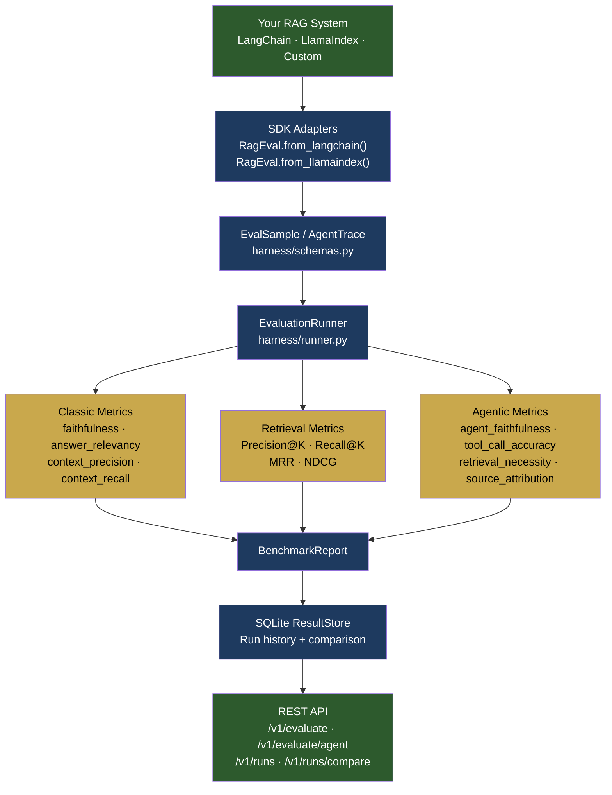
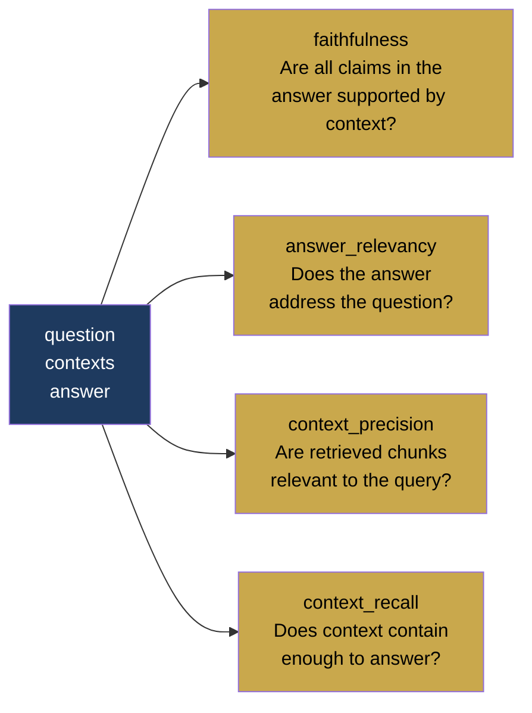
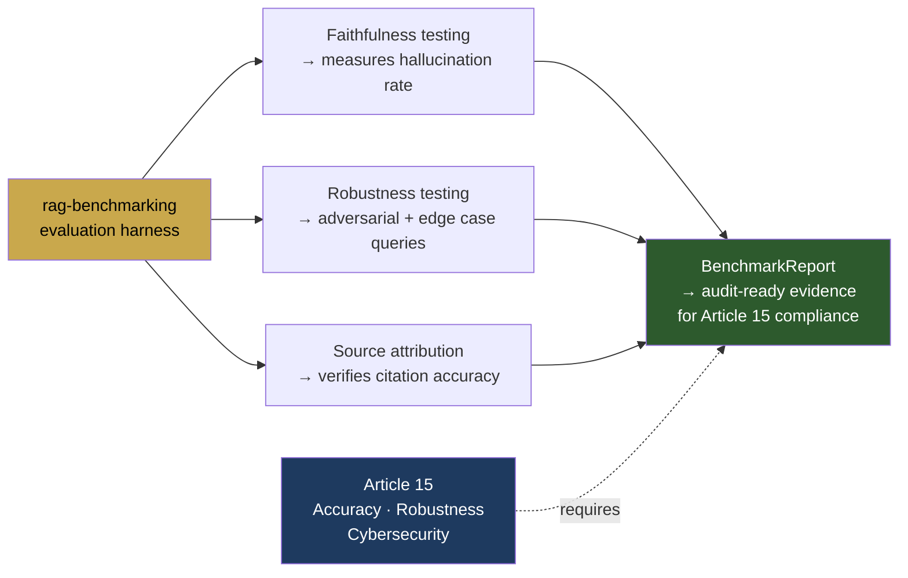
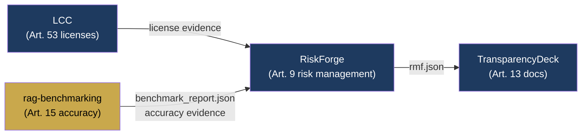

# RAG Benchmarking

[](https://pypi.org/project/rag-benchmarking/)
[](https://github.com/aiexponenthq/rag-benchmarking/actions)
[](LICENSE)
[](https://www.python.org/downloads/)
[](https://eur-lex.europa.eu/legal-content/EN/TXT/?uri=CELEX:32024R1689)

**A framework-agnostic evaluation harness for RAG and agentic AI systems.**

Bring your own RAG pipeline — LangChain, LlamaIndex, or custom — and benchmark it against classic and agentic-era metrics. Built for teams who need to prove their AI systems work before they ship.

Built by [AiExponent LLC](https://aiexponent.com). Maps to EU AI Act Article 15 (accuracy requirements).

---

## Quick Start

```bash
pip install rag-benchmarking
```

```python
from app.sdk.client import RagEval

client = RagEval(api_url="http://localhost:5001", api_key="your-key")

# Works with LangChain
result = my_chain.invoke({"query": "What is RAG?"})
sample = RagEval.from_langchain(result)

# Or any dict with question / contexts / answer
sample = {
    "question": "What is RAG?",
    "contexts": ["RAG stands for Retrieval-Augmented Generation."],
    "answer": "RAG combines retrieval with LLM generation.",
}

report = client.evaluate([sample], metrics=["faithfulness", "answer_relevancy"])
print(report["scores"])
# {"faithfulness": 0.958, "answer_relevancy": 0.810}
```

```bash
# Start the evaluation server
docker compose up
# API docs: http://localhost:5001/docs
```

---

## Architecture



---

## Metrics

### Classic RAG Metrics



| Metric | What it measures | LLM judge |
|---|---|---|
| `faithfulness` | Are all claims in the answer supported by context? | Yes |
| `answer_relevancy` | Does the answer address the question? | Yes |
| `context_precision` | Are retrieved chunks relevant to the query? | Yes |
| `context_recall` | Does context contain enough to answer correctly? | Yes |
| `precision_at_k` | Fraction of top-K retrieved docs that are relevant | No |
| `recall_at_k` | Fraction of relevant docs found in top-K | No |
| `mrr` | Reciprocal rank of first relevant doc | No |
| `ndcg_at_k` | Rank-weighted retrieval quality | No |

### Agentic-Era Metrics

For multi-step agents, tool-using systems, and autonomous RAG pipelines:

| Metric | What it measures | LLM judge |
|---|---|---|
| `source_attribution_accuracy` | Did the agent cite sources it actually retrieved? | No — deterministic |
| `agent_faithfulness` | Is every reasoning step faithful to retrieved sources? | Yes |
| `tool_call_accuracy` | Did the agent choose the right tool at the right time? | Yes |
| `retrieval_necessity` | Was retrieval actually needed for this query? | Yes |

### Metric Groups

```python
# Use pre-defined groups
report = client.evaluate(samples, metric_group="classic")
report = client.evaluate(samples, metric_group="retrieval")
report = client.evaluate(samples, metric_group="agentic_v1")
report = client.evaluate(samples, metric_group="full")  # all metrics
```

---

## Benchmarks

Measured on the built-in 50-sample golden dataset (10 domains):

| Metric | Score | Label |
|---|---|---|
| faithfulness | **0.958** | Excellent |
| answer_relevancy | **0.810** | Good |

---

## LLM Backend

Several metrics use an LLM as a judge. Supported providers:

```bash
# .env
LLM_PROVIDER=gemini       # recommended
GEMINI_API_KEY=your-key

# Or OpenAI
LLM_PROVIDER=openai
OPENAI_API_KEY=your-key
```

**Cost guidance:** A full classic-metrics pass on 50 samples costs ~$0.05–$0.15 with Gemini Flash or GPT-4o-mini. Source attribution accuracy is deterministic and costs nothing.

**Determinism:** Judge calls run at `temperature=0.0`. For CI/CD, flag changes beyond ±0.05 rather than asserting exact scores.

---

## API Reference

```bash
# Evaluate a RAG sample
curl -X POST http://localhost:5001/v1/evaluate \
  -H "X-API-Key: your-key" \
  -H "Content-Type: application/json" \
  -d '{
    "samples": [{"question": "What is RAG?",
      "contexts": ["RAG is Retrieval-Augmented Generation."],
      "answer": "RAG combines retrieval with generation."}],
    "metrics": ["faithfulness", "answer_relevancy"]
  }'

# Evaluate an agentic trace
curl -X POST http://localhost:5001/v1/evaluate/agent \
  -H "X-API-Key: your-key" \
  -H "Content-Type: application/json" \
  -d '{
    "trace": {
      "question": "What is the GPAI deadline?",
      "final_answer": "GPAI obligations apply from August 2025.",
      "tool_calls": [{"tool_name": "retrieve",
        "tool_input": {"query": "GPAI deadline"},
        "tool_output": "Article 53 obligations apply from August 2025.",
        "step_index": 0}]
    },
    "metrics": ["source_attribution_accuracy", "tool_call_accuracy"]
  }'

# Compare runs
curl -X POST http://localhost:5001/v1/runs/compare \
  -H "X-API-Key: your-key" \
  -d '["run-id-a", "run-id-b"]'
```

---

## EU AI Act Article 15



Systematic RAG evaluation produces audit-ready evidence for Article 15's accuracy and robustness requirements.

---

## AiExponent Toolchain

rag-benchmarking feeds accuracy evidence into RiskForge for Article 9 risk management:



---

## Configuration

```bash
# .env
LLM_PROVIDER=gemini
GEMINI_API_KEY=...
OPENAI_API_KEY=...

# Vector store (built-in RAG pipeline only)
QDRANT_URL=https://your-cluster.qdrant.io
QDRANT_API_KEY=...

# API authentication
API_KEY=your-secret-key
ENFORCE_API_KEY=true
```

---

## Project Structure

```
src/
  harness/            # Framework-agnostic evaluation harness
    schemas.py        # EvalSample, AgentTrace, BenchmarkReport
    protocol.py       # RAGEvaluable Protocol — the plug-in contract
    runner.py         # EvaluationRunner — orchestrates metrics
    result_store.py   # SQLite persistence
  app/
    api/              # FastAPI endpoints
    eval/             # Metric implementations
    sdk/              # Python SDK (RagEval client)
data/
  golden/qa.jsonl     # 50-sample golden dataset (10 domains)
```

---

## Known Limitations

- English-only benchmark datasets; no multilingual evaluation.
- Custom dataset integration requires manual formatting to the JSONL schema.
- Accuracy metrics only — latency and throughput are not measured.
- LLM-as-judge quality depends on the configured judge model.
- Rate limiting is in-memory and resets on server restart.

---

## Contributing

See [CONTRIBUTING.md](CONTRIBUTING.md). Issues and PRs welcome.

```bash
git clone https://github.com/aiexponenthq/rag-benchmarking
cd rag-benchmarking
pip install -e ".[test]"
pytest
```

---

## License

[Apache 2.0](LICENSE) — free to use, modify, and distribute.

Built by [AiExponent LLC](https://aiexponent.com) — `hello@aiexponent.com`

---

*Part of the AiExponent open-source AI governance toolchain:
[license-compliance-checker](https://github.com/aiexponenthq/license-compliance-checker) ·
**rag-benchmarking** ·
[RiskForge](https://github.com/aiexponenthq/riskforge)*
